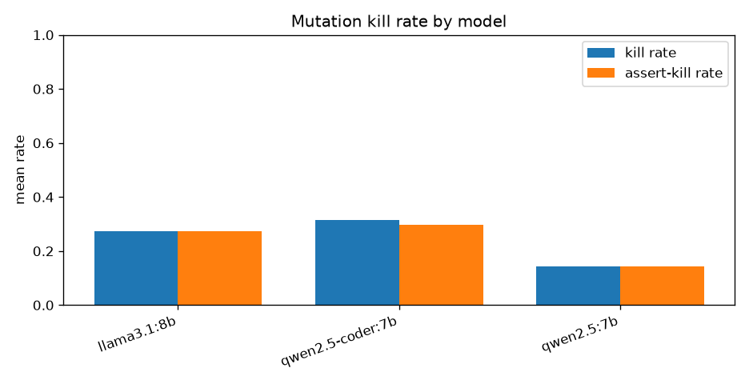

# llm-testgen-bench

**How good are the pytest suites that local LLMs write?** — graded not by an LLM
judge but by **mutation testing**. A model generates a test suite; the suite must
first pass against the correct implementation (or it is *invalid*); then the harness
generates single-mutation variants of that implementation and scores the suite on how
many it catches. The score — mutation **kill rate** — is deterministic, adversarial,
and judge-free: it cannot be talked into a different value.

## Headline result (3 local 7–8B models × 21 tasks, CPU)

| model | valid% | mean kill | mean assert-kill | tokens/task | sec/task |
|---|---|---|---|---|---|
| **qwen2.5-coder:7b** | **33%** | **0.32** | 0.30 | 642 | 48 |
| llama3.1:8b | 29% | 0.27 | 0.27 | 640 | 68 |
| qwen2.5:7b | 14% | 0.14 | 0.14 | 752 | 72 |

The number that matters isn't in the table — it's the gap behind it:

- **Only 25% of all generated suites are even valid** (16 of 63) — i.e. three-quarters
  fail against the *correct* code they're supposed to test.
- **Zero were malformed.** Every model always produced parseable, importable Python.
  The failures are *wrong assertions about behaviour*, not broken syntax.
- **But a valid suite is strong: mean kill rate 0.96.** When a model actually
  understands the contract, its tests catch nearly every mutant.
- So the bottleneck is **comprehension, not competence** — reading the spec correctly,
  not writing good assertions.
- **Off-by-one wiped the floor: 0 of 9 suites valid.** Every model, on every
  pagination/chunk/interval task, asserted at least one boundary wrong.
- The **code-specialised** model wins on both validity and kill rate — a sane,
  expected ordering that says the benchmark measures something real.



Full numbers: [`results/leaderboard.md`](results/leaderboard.md).

## Methodology

A good test suite fails when the code under test is wrong. So we break the code on
purpose, one edit at a time (swap a `<` for `<=`, an `and` for an `or`, bump a
constant) and ask: did the suite notice? A suite that catches 9 of 10 mutants is
measurably better than one that catches 2 — no rubric, no judge, no vibes. The only
LLM in the loop is the one *writing the tests*; grading is pure AST manipulation and
subprocess pytest runs.

## Quickstart

Two scripts, no prerequisites beyond Python 3.11+ and [Ollama](https://ollama.com):

```bash
./setup.sh          # venv + pinned deps + verify (95 tests)     | Windows: setup.bat
./run.sh --smoke    # quick check against a tiny model            | Windows: run.bat --smoke
./run.sh            # full 3-model matrix                         | Windows: run.bat
```

`setup.sh` installs from `requirements.lock`, so you get the exact versions these
results were produced with. `run.sh` refuses to start if Ollama isn't reachable, and
accepts a model list: `./run.sh qwen2.5-coder:7b`.

Prefer Make? `make setup` / `make test` / `make smoke` / `make run` do the same.
Neither? `python verify.py` and `python -m llm_testgen_bench.cli …`.

## Mutation operators (backend: `pymutant`, pure stdlib)

| Category | Mutation |
|---|---|
| comparison | `<`↔`<=`, `>`↔`>=`, `==`↔`!=` |
| arithmetic | `+`↔`-`, `*`↔`//` |
| boolean | `and`↔`or`, `not X`→`X` |
| constant | int `n`→`n+1`, `True`↔`False` |
| boundary | slice/`range` int arg `n`→`n+1` (a labelled subset of the constant op) |
| return | `return X`→`return None` |

Each mutant applies exactly one mutation to a fresh AST copy. Mutants are produced in
deterministic walk order, deduplicated by unparsed source (this drops most equivalent
mutants), kept only if they compile, and capped at 30 per task. Kills are split into
`assertion` / `crash` / `timeout`; `assertion_kill_rate` is the honest headline so a
mutant that merely errors isn't mistaken for a mutant the suite meaningfully caught.

## Corpus taxonomy

21 pure functions, 3 per failure class. Every `impl.py` is hand-written, reviewed, and
covered by golden cases in its own `meta.yaml` (the harness's hidden ground truth,
verified by `tests/test_corpus_sanity.py` and never shown to models).

| Failure class | Tasks | Probes |
|---|---|---|
| `off_by_one` | t01–t03 | pagination, chunking, half-open interval overlap |
| `empty_and_none` | t04–t06 | last-index sentinel, blank-skipping, middle truncation |
| `unicode_text` | t07–t09 | casefold dedupe, combining-mark length, word counting |
| `float_precision` | t10–t12 | dollars→cents, exact remainder split, half-up tax |
| `mutation_aliasing` | t13–t15 | sort/rotate/dedupe that must not mutate the input |
| `ordering_stability` | t16–t18 | competition ranking, stable grouping, stable top-N |
| `parsing_validation` | t19–t21 | semver compare, query-string parse, IPv4 validate |

The corpus was also put through an **independent adversarial audit** (21 skeptic
agents, one per task, hunting for contract violations). It caught a real one — a lazy
validation path in the semver task that the golden cases missed — now fixed with a
regression case. See `DECISIONS.md`.

## Reproducibility

This project does **not** claim determinism. `temperature=0` + `seed=42` does not yield
byte-identical output through Ollama (the OpenAI-compatible endpoint doesn't reliably
honor `seed`; batching and GPU scheduling add noise). Instead:

```bash
bench run --smoke --repeat 3   # fresh samples (auto --no-cache), then:
bench variance                 # results/variance.md: per-model spread in kill rate
```

Run-to-run spread is a *measured* number, not an assumption.

## How to add a task

1. `mkdir corpus/tasks/t22_myfeature/`
2. `impl.py` — one public function with a docstring **contract**, ≥4 mutable operators.
3. `meta.yaml` — `id, title, difficulty(1-3), failure_class, entrypoint, description,
   golden_cases` (≥3 hand-verified cases; each is `args`/`kwargs` with `expected:` or
   `raises:`).
4. `bench validate` (schema + operator count) and `make test` (runs golden cases).

## How to add a model

`ollama pull <model>`, then `bench run --models <model>,…`. The smoke model is
`BENCH_SMOKE_MODEL`. Any Ollama model on the OpenAI-compatible endpoint works — no code
change.

## Threats to validity

- **Equivalent mutants.** Some single mutations don't change behaviour and can't be
  killed. Dedup-by-source removes many; the rest depress kill rate uniformly.
- **Crash-kills vs assertion-kills.** Tracked separately; `assertion_kill_rate` is the
  headline. See `DECISIONS.md`.
- **Whole-suite validity is strict.** One buggy test invalidates the entire suite
  (kill rate 0). Deliberate — an unusable suite deserves zero — but it makes the
  benchmark harsh, which is why 75% of suites here score zero.
- **Small k, local-model variance.** Default `k=1`; a single sample is noisy. Read
  `bench variance` before treating a leaderboard gap as real.
- **Ground-truth risk.** Every number rests on the corpus being correct. It is verified
  by execution and an adversarial audit, but a corpus this small should still get a
  human read before results are cited.

## Layout

```
llm_testgen_bench/   config, ollama_client, corpus, generate, sandbox,
                     mutate, score, report, cli, testing
corpus/tasks/        t01..t21 — impl.py + meta.yaml (with golden_cases)
prompts/             generate_tests.txt
tests/               95 harness tests
results/             leaderboard.md + kill_rates.png (committed) + gitignored raw
```

## License

MIT
